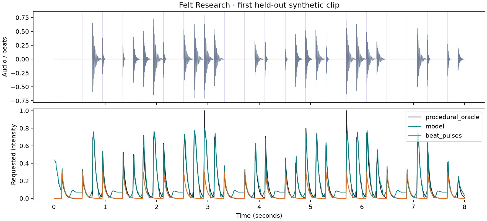

# Experiment 001: causal audio and beat conditioning

Can a small causal model approximate a known synthetic haptic mapping on unseen rhythm
families? Does supplying audio and beat timing together help under this fixed training recipe?

## Setup

One seed, 30 epochs, 192 training clips, 48 validation clips, and 48 test clips. There are
48/12/12 rhythm families, each with four variations. All audio is synthesized by this repository.
The combined model has 11,169 parameters. All three models use the same data, hidden width,
optimizer recipe, and epoch budget, but input widths and initial random draws differ.
This is an initial ablation, not a parameter-matched or multi-seed study.

Training and evaluation ran on an Apple Silicon Mac using CPU float32 with four threads.
Checkpoints were selected by validation loss. The test set was evaluated after training;
no hyperparameter changes were made in response to these test results.

## Results

| Method | Intensity RMSE ↓ | Active RMSE ↓ | Event F1 ↑ | Quiet-region mean intensity ↓ |
|---|---:|---:|---:|---:|
| Audio + beats | 0.0658 | 0.0577 | 0.9685 | 0.0690 |
| Audio only | 0.0808 | 0.1119 | 0.8823 | 0.0778 |
| Beats only, learned | 0.1588 | 0.1921 | 0.7130 | 0.1528 |
| Beat pulses, deterministic | 0.1583 | 0.2991 | 0.7326 | 0.0027 |
| Training-target mean | 0.1715 | 0.2954 | 0.0000 | 0.1014 |
| Silence | 0.1995 | 0.3764 | 0.0000 | 0.0000 |
| Procedural teacher, oracle | 0.0000 | 0.0000 | 1.0000 | 0.0050 |

The combined model approximated the rule more closely than either input ablation under
this recipe. The teacher explicitly depends on both inputs, so this outcome is expected.
The teacher remains exact, cheaper, and the best implementation of this particular rule.
The learned beat-only model did not improve overall RMSE over deterministic beat pulses.

The combined model matched 1,322 target threshold crossings, missed 36, and added 50.
Matched-event timing MAE was 0.54 ms. The underlying grid is 10 ms; averaging many exact
matches and some grid-sized errors produces this smaller mean. This does not demonstrate
sub-millisecond timing resolution or real-world synchronization accuracy.

## Inspect and listen

- [Source audio](combined/source.wav)
- [Model sonification](combined/model.wav)
- [Source left, model right](combined/comparison.wav)
- [Deterministic beat-pulse preview](combined/beat_pulses.wav)
- [Teacher preview](combined/procedural_oracle.wav)
- [Generated pattern](combined/model.json)
- [Full combined metrics and environment](combined/metrics.json)
- [Dataset manifest](manifest.json)

This is the first test example in manifest order, not a selected best-looking result.
The audio preview preserves the 10 ms frame-end offset and uses fixed gain for all methods.

## What failed or remains unproven

- The combined model leaves a residual intensity around 0.07 in quiet regions and produces
  a false pulse at startup. Physical playback may turn these into an unwanted buzz or tap.
- It underestimates some high-intensity peaks. Weighted MSE favors active-frame fit and can
  sacrifice silence. A later experiment should explicitly examine that tradeoff.
- Generalization is limited to new patterns from the same simple sound generator. There are
  no real recordings, tempo changes within clips, noisy beat estimates, or human judgments.
- The model has no explicit chunk-state inference API yet. Causality is verified, but deployed
  streaming behavior and latency are not. A future adapter must retain the 28 previous frames.
- These results are from one seed. There are no confidence intervals or perceptual claims.
- CPU whole-clip model latency is logged for inspection, but is not a deployment benchmark.
  Some evaluations ran alongside other local work, so cross-model timings should not be ranked.

## Reproduce

Follow the root README. Each model folder includes the 30-epoch loss history, predictions,
previews, and metrics. The manifest identifies every source pattern and generation seed.
Full resumable checkpoints remain local under `runs/`. The validation-selected inference
checkpoints are now available under MIT in [models/001](../../models/001/README.md).
Training provenance points to the source commit used for each run. Later documentation and
lint-only commits do not alter the training implementation.

Local validation passed five tests covering data isolation, causal features and model output,
audio timebase/gain, exact CPU epoch-boundary resumption, and the evaluation/export path.
The package builds as a wheel and source distribution.
