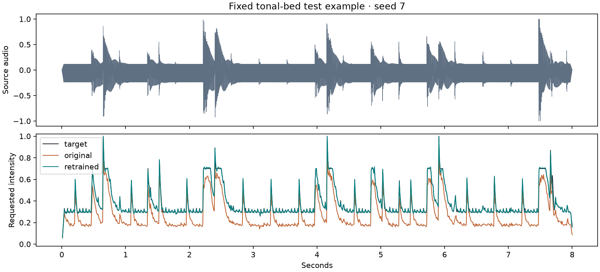

# Sound diversity study 004

The study compares three fixed models trained on the earlier percussion generator
with three models trained from scratch on diverse procedural sounds. All six use
the same architecture and are evaluated on the same 480 new test clips. The new
2,880-clip dataset has no canonical-family overlap with either earlier study.

All three retrained models passed the aggregate acceptance targets, with no
profile-level failures. Tonal event F1 ranged from 0.95017 to 0.95435, just above
the 0.95 threshold, so sustained tones remain the weakest profile.
These targets were fixed before evaluation. Missing quiet-region metrics are recorded
as null and are not counted as a successful quiet-region measurement.

## Held-out results

| Seed | Training data | RMSE | Active RMSE | Event F1 | Startup RMSE |
|---|---|---:|---:|---:|---:|
| 7 | original | 0.03648 | 0.05885 | 0.87904 | 0.02948 |
| 7 | retrained | 0.00449 | 0.00700 | 0.98285 | 0.00250 |
| 19 | original | 0.03058 | 0.04987 | 0.87949 | 0.02330 |
| 19 | retrained | 0.00385 | 0.00566 | 0.98226 | 0.00233 |
| 42 | original | 0.03490 | 0.05673 | 0.87811 | 0.02713 |
| 42 | retrained | 0.00387 | 0.00590 | 0.98092 | 0.00239 |

Profile averages below are across the three predetermined initialization seeds.
Each profile contains 120 test clips. They share the same 120 test rhythm families,
so these are not 480 independently sampled families.

| Sound profile | Original RMSE | Retrained RMSE | Original F1 | Retrained F1 |
|---|---:|---:|---:|---:|
| noise_bed | 0.03724 | 0.00396 | 0.95662 | 0.99303 |
| percussion | 0.01112 | 0.00388 | 0.99595 | 0.99810 |
| sparse_dynamics | 0.00852 | 0.00310 | 0.99758 | 0.99954 |
| tonal_bed | 0.05500 | 0.00508 | 0.65369 | 0.95251 |

The unchanged procedural teacher has zero target error by construction. The new
model is learning that rule, including its response to noise and sustained tones.
The fixed tonal preview shows sustained requested intensity between beats, which
may become continuous vibration on hardware. That is faithful to the teacher, but
its usefulness has not been established. A higher event F1 here means better agreement with intensity threshold crossings,
not improved beat detection or evidence that someone prefers the sensation.

Both training conditions use 1,920 training clips, the same epoch count and the
same three initialization seeds. Training families and synthesis differ, so this
comparison does not isolate timbre from every other data difference. All models
were evaluated without selecting a winning seed or tuning on this test set.

The three diverse training runs took 247.3
seconds total including pilot and resume overhead, excluding separate evaluations.
The dataset's feature/target arrays occupy 55,296,000 bytes, not peak process RAM.
All 25 tests, Ruff checks and the offline package build passed locally. The initial
Linux CI run exposed a platform-specific byte-hash assumption in a new regression
test. That test now compares outputs from the pre-change generator with explicit
numeric tolerances, while requiring exact family/beat metadata. Training code and
reported study results were unchanged by this test correction.

## Interpretation and next step

Use this as evidence about transfer within procedural audio. It does not establish
real-music robustness, musical selectivity, comfort or ring performance. The final
test set is now consumed; future tuning needs a new final holdout.

The next decision should come from [physical playback evaluation](../../docs/physical-evaluation.md)
or licensed real recordings, rather than another larger imitation run. In particular,
compare the learned model with its simpler procedural teacher before deciding which
belongs in a product.

## Reproduce and inspect

Reproduce study 003 first, then run:

```bash
uv run python scripts/run_diversity_study.py --baseline-runs runs/scale003 --out runs/new-diversity004
```

See [the plan](PLAN.md), [all paired test metrics](comparison.json),
[training summary](training-summary.json), [acceptance checks](acceptance.json),
[initial validation transfer check](baseline-validation.json), and [run records](run-records/).
Reports contain training and evaluation dataset IDs and checkpoint checksums.
Checkpoints remain local; this report releases no new weights.

The preview uses seed 7 and the first tonal-bed test clip, selected before test
inspection. Fixed-gain audio previews represent requested intensity, not physical
actuator sound or perceptual equivalence.



[Source](preview/source.wav) · [Original model](preview/original.wav) ·
[Retrained model](preview/retrained.wav) · [Procedural target](preview/target.wav)
