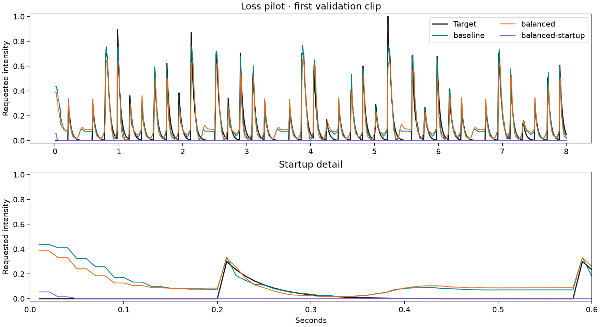

# Short loss pilot: neither candidate advances

The [preregistered plan](PLAN.md) compared three loss designs using identical synthetic
data, combined inputs, seed 42, and 30 epochs. Each run selected its best checkpoint by
its own validation loss. All results below are on the 48 validation clips. No candidate
was evaluated on the test set, and no coefficient or epoch changes followed these results.

## Results

| Loss | Quiet mean ↓ | Startup RMSE ↓ | Active RMSE ↓ | Event F1 ↑ | Training seconds |
|---|---:|---:|---:|---:|---:|
| Original baseline | 0.06770 | 0.20157 | 0.05625 | 0.96490 | 8.109 |
| Region balanced | 0.07973 | 0.16583 | 0.09601 | 0.96559 | 8.122 |
| Balanced + startup | 0.00037 | 0.08704 | 0.36475 | 0.00000 | 8.148 |

Each evaluation and artifact export took about 1.36 seconds. Total measured subprocess
wall time was **28.466 seconds**, including interpreter startup, generation, training,
checkpoint writing, evaluation, plots, and audio previews. Runs were sequential on the
Mac CPU with four threads. This is one local timing sample, not a hardware benchmark.

The promotion gates required at least 50% reductions in quiet output and startup RMSE,
no more than 20% higher active RMSE, and at most a 0.02 absolute event-F1 drop.

| Candidate | Quiet | Startup | Active accuracy | Event F1 | Advance? |
|---|---|---|---|---|---|
| Region balanced | Fail | Fail | Fail | Pass | No |
| Balanced + startup | Pass | Pass | Fail | Fail | No |

The startup-focused model produced no events above the fixed 0.2 threshold and missed
all 1,393 target events. Lower quiet output alone would have selected a failed model.
Its mean first-frame intensity fell from 0.4375 to 0.0553, but useful pulses were also
suppressed. This run does not isolate whether optimization, weighting, or architecture
is the primary cause. The region-balanced candidate also worsened quiet-region output.

## Inspect

- [Baseline: source left, prediction right](baseline/comparison.wav)
- [Region-balanced preview](balanced/comparison.wav)
- [Startup-focused preview](balanced-startup/comparison.wav)
- [Machine-readable summary, gates, and timing](summary.json)

Example selection is the first validation clip in manifest order. Each variant folder
contains its resolved config, complete metrics, loss history, prediction, and preview.
The metrics include the dataset identity and training/evaluation environment. Loss values
have different scales across objectives and must not be compared directly.

## Decision

Keep the original baseline and do not launch an overnight sweep of these candidates.
Three training jobs took about 24.4 seconds in total. At this observed scale, 15 comparable
jobs would take roughly 2.4 minutes including evaluation, not overnight. That extrapolation
does not apply to larger models, other hardware, or a more diverse audio generator.

The next proposed step is another small diagnostic of startup behavior, including model
initialization or boundary treatment, before choosing a broader loss sweep. A multi-seed
study should separate initialization seeds from dataset seeds first. No follow-up run is
scheduled or running. This single-seed synthetic pilot does not establish perceptual quality.

Sixteen local tests passed, including causal behavior, checkpoint resumption, validation
split export, finite gradients for empty loss regions, and the startup penalty's behavior.
