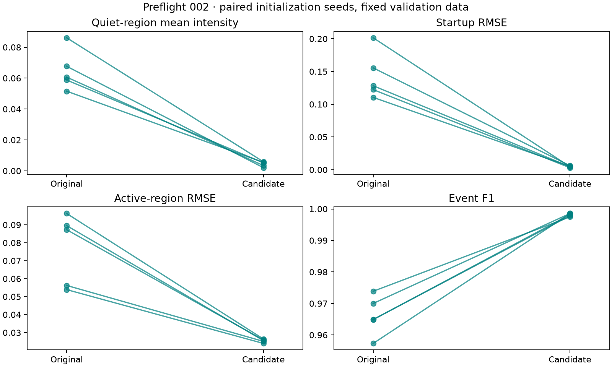
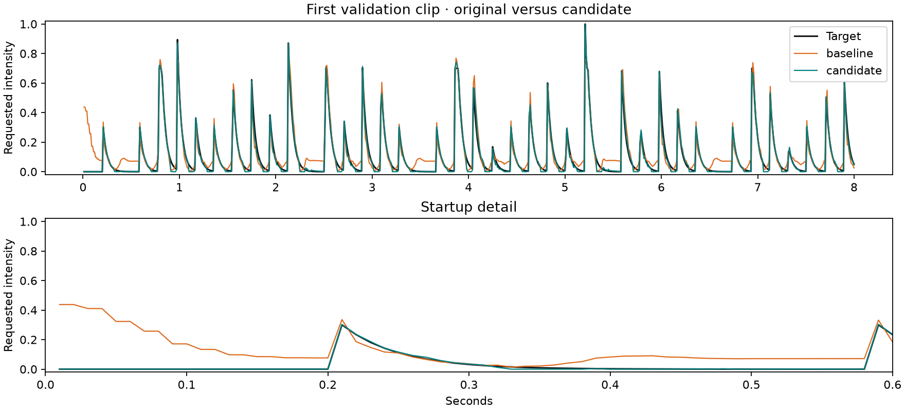

# Preflight 002: ready for a larger synthetic study

The `warmup-linear-v2` candidate passed every preregistered gate for all five paired
initialization seeds. Proceeding to a larger **synthetic research study** is reasonable.
This is not a certification for real music, human comfort, or ring deployment. No scaled
run has been launched, and candidate weights have not been published.

## What changed

The original network padded hidden activations with zeros at the beginning of each
clip. On entirely silent input, its first output was 0.4375, settling to 0.0712 once
history filled. Keeping the same weights but supplying 28 silent input-history frames
reduced validation startup RMSE from 0.2016 to 0.0567 and extra events from 52 to 4.
This isolates a substantial boundary effect without retraining; it did not remove the
remaining quiet-region floor.

The chosen candidate combines:

- 28 silent input-history frames at stream reset, with their outputs discarded.
- A linear output clamped to [0,1], with output bias initialized to 0.1, permitting exact zero.
- The original active-weighted loss, architecture width, and 30-epoch training recipe.

Silent prehistory is an explicit reset assumption. The reference `EnvelopeStream` retains
28 actual feature frames between chunks; it must not be reset on every audio callback.
No future audio is used. Original v1 checkpoints retain their original architecture semantics.

The warmup-only sigmoid candidate improved timing but failed quiet-output gates. It remains
in [screen-summary.json](screen-summary.json), including its failed gates. The bounded-linear
candidate passed development screening and was then checked against the original at seeds
7, 19, 42, 73, 101. Dataset seed 42 stayed fixed, and dataset hashes matched in all runs.
Seed 42 was used during development, so only four initialization seeds were new checks.

## Validation results

Means across five paired seeds, each evaluated on the same 48 validation clips:

| Metric | Original | Candidate |
|---|---:|---:|
| Overall RMSE | 0.06498 | 0.01554 |
| Quiet-region mean intensity | 0.06498 | 0.00437 |
| Startup RMSE | 0.14368 | 0.00467 |
| Active-region RMSE | 0.07667 | 0.02536 |
| Event F1 | 0.96619 | 0.99813 |

Candidate event F1 ranged from 0.99749 to 0.99856. Active RMSE ranged from 0.02395 to
0.02638. Every seed passed both relative-improvement and absolute-quality gates in the
[plan](PLAN.md). These describe imitation of a synthetic rule, not human preference.



## Execution checks

- All five candidate models passed silence, beat-only, impulse, 55 Hz tone, and noise
  probes for finite bounded output. Probe quality beyond bounds was not certified.
- Worst silence peak across candidates was 0.00343, below the 0.02 gate.
- Frame-by-frame predictions matched whole-clip outputs within the declared tolerance.
- CPU per-frame model/history-handling p95 ranged from 0.154 to 0.181 ms after warmup.
  This excludes audio feature extraction, audio I/O, scheduling, transport, and actuation.
- Mac GPU inference on one random feature tensor agreed with CPU to a maximum absolute
  difference of 0.000000239. This is an inference smoke test, not GPU training validation.
- All three originally released v1 weights still loaded and predicted successfully.
- Twenty-two local tests passed, including causality, exact CPU resumption for v2,
  fixed data across initialization seeds, stream reset, and chunk equivalence.

Ten paired runs took **103.607 seconds** including training, validation, and probes.
The three development runs took about 31 seconds. Minor concurrent verification work
means these are practical local wall times, not isolated performance benchmarks.

## Inspect and reproduce



- [Original preview: source left, prediction right](baseline/comparison.wav)
- [Candidate preview: source left, prediction right](candidate/comparison.wav)
- [All confirmation metrics, probes, and gate decisions](confirmation-summary.json)
- [Run configs, histories, and evaluation provenance](runs/)
- [Mac GPU inference check](mps-inference.json)

Examples use the first validation clip and the prespecified development seed 42, not
the best-performing seed. Candidate checkpoints remain local in `runs/preflight002-confirm/`.

```bash
uv run python scripts/run_preflight.py --stage screen --out runs/new-screen
uv run python scripts/run_preflight.py --stage confirm --candidate warmup-linear-v2 --out runs/new-confirm
uv run python -m felt.train --config configs/preflight002-candidate.json --out runs/new-candidate
```

## What to scale next

Use the versioned candidate configuration; keep the old Experiment 001 recipe as a baseline.
The next study should expand sound diversity and vary tempo within clips, overlap sources,
and test imperfect supplied beats. Freeze a new evaluation protocol and reserve a fresh
final holdout before tuning against those conditions. This validation set has been used
repeatedly; it must not be described as an untouched final test set.

No candidate was evaluated on the old test split. The generator currently computes all
splits in memory, so a genuinely large corpus needs sharded or streamed loading before
GPU memory use scales. CUDA and MPS training throughput/resume remain unverified; test the
chosen training backend before committing compute. The CPU reference pipeline is ready
for a bounded increase in synthetic workload, not an arbitrary large-model run.
