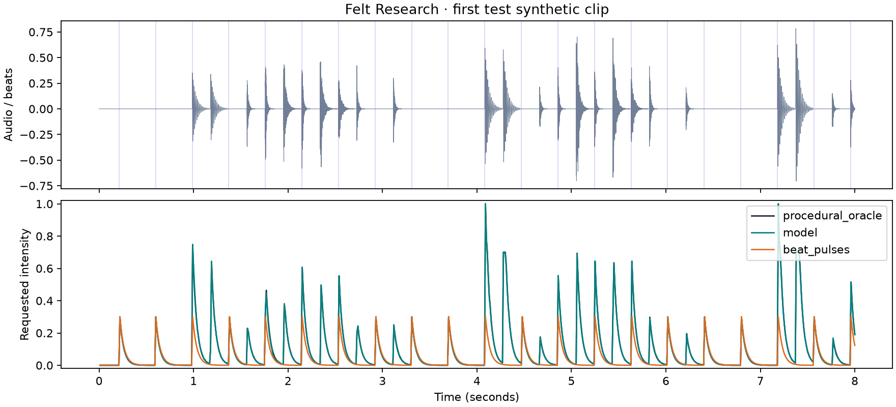

# Scale study 003 results

All three predetermined initialization seeds passed the acceptance targets on 480
new held-out synthetic clips. The dataset has 1,920 training and 480 validation clips,
with zero canonical rhythm-family overlap against the earlier development dataset.
The model and training schedule were frozen before this test evaluation.

| Seed | Training seconds | Test RMSE | Active RMSE | Event F1 | Startup RMSE | All targets passed |
|---|---:|---:|---:|---:|---:|---|
| 7 | 75.5 | 0.003454 | 0.006090 | 0.999232 | 0.000791 | True |
| 19 | 74.0 | 0.002867 | 0.005109 | 0.999707 | 0.000658 | True |
| 42 | 74.5 | 0.003065 | 0.005411 | 0.999744 | 0.000622 | True |

Training times include the three-epoch pilot, process restarts and resumed training;
they exclude evaluation. The three runs took approximately 224 seconds of training
in total on CPU with four threads. Feature and target arrays occupy 55,296,000 bytes;
this is not peak process memory. Source audio was regenerated rather than stored.

Quiet-region mean intensity is approximately 0.00504 for each model. The teacher's
quiet-region mean is 0.00508, because this metric includes release tails below 0.02.
It is not a pure-silence measurement. First-frame mean intensity is zero for all seeds.
Event matching uses a 30 ms tolerance on a 10 ms grid; the tiny mean matched timing
error does not indicate sub-millisecond temporal resolution.

The procedural oracle remains exact, with zero RMSE, and is cheaper than the model.
This demonstrates reliable learned imitation of that rule on new synthetic rhythms.
It does not demonstrate real-music generalization, perceived haptic quality or a
reason to replace the deterministic rule in a product yet. Increasing the dataset
also increased optimizer steps at the same epoch count, so this study does not
isolate data volume from compute. Its test scores are not directly comparable to
previous validation scores on a different dataset.

The next useful experiment should expand sound diversity and test physical output,
not simply add epochs. This test set is now consumed for this fixed evaluation;
future tuning needs a new final holdout.

## Reproduction and evidence

See [the frozen plan](PLAN.md), [full summary](summary.json), and per-seed configs,
histories, environments, metrics and acceptance checks in [run-records](run-records/).
Run `uv run python scripts/run_scale_study.py --out runs/new-scale003`.
Checkpoints remain in local ignored run directories; this report releases no new weights.
All 22 existing tests, Ruff checks and formatting checks passed locally.

The preview uses seed 7, the first predetermined seed, and the first test clip in
manifest order. It was not selected by score. Audio is a sonification of requested
intensity, not a prediction of the ring's physical sound or sensation.

[Source/model stereo preview](preview-seed7/comparison.wav)
